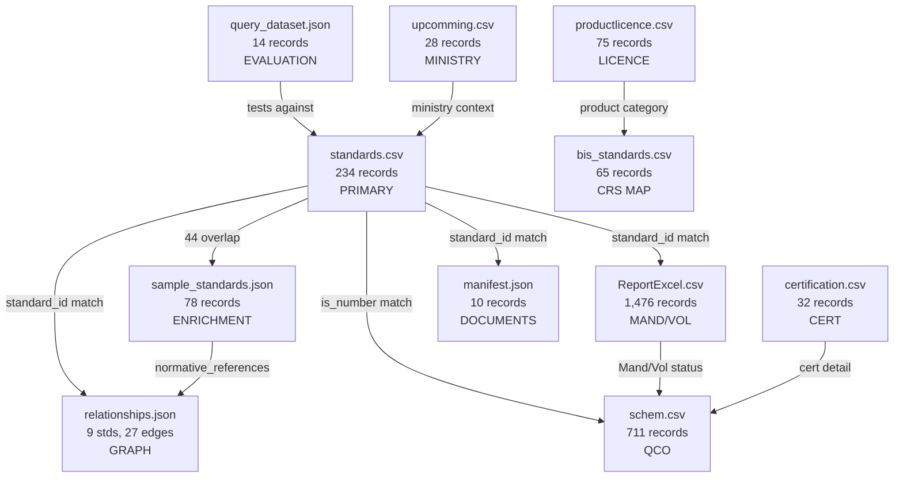

# Data Inventory — PS 26108 Knowledge Base

> **Generated**: 2026-09-15  
> **Source directory**: `Skill-Connect/csvfiles/` (12 files)  
> **Root duplicates**: `Skill-Connect/bis_standards.csv` and `bis_standards.json` (smaller subsets — see §2.1)

---

## 1. File Inventory Summary

| # | File | Format | Size | Records | Purpose |
|---|------|--------|------|---------|---------|
| 1 | `standards.csv` | CSV | 66 KB | **234** | **PRIMARY** structured standard records (richest schema) |
| 2 | `sample_standards.json` | JSON | 61 KB | **78** | Detailed standard records with scope, description, normative refs, amendments |
| 3 | `ReportExcel.csv` | CSV | 155 KB | **1,476** | Mandatory/Voluntary classification for Indian Standards |
| 4 | `schem.csv` | CSV | 277 KB | **711** | QCO scheme mapping: standard → product → notification → links |
| 5 | `certification.csv` | CSV | 7 KB | **32** | Certification product-rating mappings (low-voltage switchgear) |
| 6 | `productlicence.csv` | CSV | 4 KB | **75** | Product category → total licence count |
| 7 | `bis_standards.csv` (csvfiles) | CSV | 11 KB | **66** | CRS product → IS standard mapping |
| 8 | `bis_standards.json` (csvfiles) | JSON | 15 KB | **77** | JSON form of product → licence count (mislabeled columns) |
| 9 | `relationships.json` | JSON | 6 KB | **9 standards, 27 edges** | Standard relationship graph (testing, safety, performance, supersession) |
| 10 | `manifest.json` | JSON | 4 KB | **10** | Source document metadata (PDF provenance) |
| 11 | `query_dataset.json` | JSON | 6 KB | **14** | Evaluation queries with expected intents and retrieval behavior |
| 12 | `upcomming.csv` | CSV | 4 KB | **28** | Ministry/Department → Product → Indian Standard mapping |

### Root-Level Duplicates (Not in csvfiles/)

| File | Size | Records | Relation to csvfiles/ |
|------|------|---------|-----------------------|
| `bis_standards.csv` (root) | 8 KB | **30** | **Subset** — different schema ("Features" column), original scraper output |
| `bis_standards.json` (root) | 12 KB | **30** | JSON form of root CSV |

> **Decision**: The `csvfiles/` versions are supersets. Root-level files are scraper artifacts. Use `csvfiles/` as canonical source.

---

## 2. Detailed File Analysis

### 2.1 `standards.csv` — PRIMARY STANDARDS DATASET

**Purpose**: The richest and most authoritative standard record dataset.

**Headers**: `standard_id`, `title`, `description`, `category`, `department`, `year`, `status`, `supersedes`, `certification_scheme`, `qco_applicable`, `qco_reference`

| Metric | Value |
|--------|-------|
| Total records | 234 |
| Unique standard_ids | 234 |
| Active standards | 233 |
| Superseded standards | 1 (IS 325:1996) |
| With QCO applicable=True | 187 |
| With supersedes info | 31 |
| Categories | 8: Electrical, Civil & Construction, Solar Energy, Electronics & IT, Mechanical, Medical Devices, Chemicals, Food & Agriculture |
| Certification schemes | 29 distinct values (Scheme-I/ISI Mark, Scheme-II/CRS, Scheme-IV/Code of Practice, etc.) |

**Key fields**:
- `standard_id`: IS number with year (e.g., "IS 694:2010")
- `title`: Full standard title
- `description`: Detailed description including procurement context
- `category`: Domain category
- `department`: Technical committee (e.g., "ETD 09 (Cables & Conductors)")
- `year`: Publication year
- `status`: "Active" or "Superseded"
- `supersedes`: Previous standard replaced (e.g., "IS 325")
- `certification_scheme`: Certification type string
- `qco_applicable`: Boolean string "True"/"False"
- `qco_reference`: QCO order name/description

**Limitations**:
- No `part`/`section` fields (embedded in standard_id string)
- No structured `normative_references` (only in sample_standards.json)
- No `amendments` information
- `department` field inconsistent formatting across records

---

### 2.2 `sample_standards.json` — DETAILED STANDARD RECORDS

**Purpose**: Richer per-standard metadata with scope, normative references, amendments.

**Schema per record**:
```json
{
  "is_number": "IS 269",
  "part": null,
  "section": null,
  "title": "Ordinary Portland Cement — Specification",
  "scope": "...",
  "description": "...",
  "subject_area": "Civil Engineering",
  "division": "Cement and Concrete",
  "technical_committee": "CED 2",
  "year_of_publication": 2015,
  "latest_year": 2015,
  "status": "CURRENT",
  "is_mandatory_certification": true,
  "certification_type": "BIS_ISI",
  "normative_references": ["IS 4031", "IS 456", "IS 383"],
  "amendments": [{"number": 1, "year": 2020, "description": "Amendment 1"}]
}
```

| Metric | Value |
|--------|-------|
| Total records | 78 |
| Unique is_numbers | 77 (IS 398 appears twice: Part 1, Part 2) |
| CURRENT status | 74 |
| SUPERSEDED status | 4 (IS 8112, IS 12269, IS 13947, IS 722, IS 2171) |
| With amendments | 6 |
| With normative_references | 41 |
| Mandatory certification | 40 |
| Subject areas | 12 (Civil, Mechanical, Electrical, Electronics, Safety, Environmental, Food Technology, Chemical, Agriculture, Textile, Instrumentation, Chemical Engineering) |
| Divisions | 8 |
| Certification types | 2: BIS_ISI, CRS |

**Overlap with standards.csv**: 44 of 78 standards overlap. 33 are unique to sample_standards.json.

**Unique fields NOT in standards.csv**:
- `scope` — very valuable for semantic search
- `part`, `section` — structured standard decomposition
- `subject_area`, `division` — richer categorization
- `technical_committee` — committee code
- `normative_references` — array of related standard IDs
- `amendments` — structured amendment history
- `is_mandatory_certification` — boolean
- `certification_type` — enum (BIS_ISI, CRS)

---

### 2.3 `ReportExcel.csv` — MANDATORY/VOLUNTARY CLASSIFICATION

**Purpose**: Broad classification of 1,476 Indian Standards as Mandatory or Voluntary.

**Headers**: `S.NO.`, `Standard Number`, `Standard Title`, `Mandatory/Voluntary`

| Metric | Value |
|--------|-------|
| Total records | 1,476 |
| Mandatory | 487 |
| Voluntary | 989 |

**Key characteristics**:
- Broadest coverage of any dataset (1,476 unique standards)
- Standard numbers include year (e.g., "IS 269 : 2015")
- Title is ALL CAPS
- Only Mandatory/Voluntary — no further detail
- Some encoding issues (e.g., "�" artifacts)

**Value**: Essential for determining mandatory vs. voluntary status at scale.

---

### 2.4 `schem.csv` — QCO/SCHEME MAPPING

**Purpose**: Maps standards to products, QCO notifications, and notification links.

**Headers**: `sr_no`, `is_number`, `product`, `notification`, `notification_links`

| Metric | Value |
|--------|-------|
| Total records | 711 |
| With notification text | 189 |
| Without notification | 522 |

**Key characteristics**:
- `sr_no` groups standards under the same QCO order (many standards share one sr_no)
- Some rows have no `sr_no` (continuation/de-notification rows)
- `notification_links` is a JSON array string containing `{text, url}` pairs
- Covers QCO orders from multiple sectors: Cement, Electrical, Food, Chemicals, Steel, etc.
- Includes "De-notified" product records (e.g., food products removed from compulsory certification)

**Value**: Primary source for QCO/notification intelligence.

---

### 2.5 `certification.csv` — CERTIFICATION PRODUCT RATINGS

**Purpose**: Maps specific product ratings/categories to certification standard numbers.

**Headers**: `sr_no`, `is_number`, `product`, `notification`, `notification_links`

| Metric | Value |
|--------|-------|
| Total records | 32 |
| Standards covered | 5 (IS/IEC 60947 Parts 2, 3, 4, 5 — Low-Voltage Switchgear) |

**Key characteristics**:
- Focused exclusively on low-voltage switchgear certification
- `sr_no` uses sub-numbering (e.g., "1.1 (a)", "3.2")
- `notification` column contains product description text, NOT notification orders
- `product` column contains the standard title
- Column semantics differ from same-named columns in other CSVs

**Limitation**: Very narrow domain coverage (only switchgear).

---

### 2.6 `productlicence.csv` — PRODUCT LICENCE COUNTS

**Purpose**: Lists product categories with their total active licence counts.

**Headers**: `sr_no`, `is_number`, `product`, `notification`, `notification_links`

| Metric | Value |
|--------|-------|
| Total records | 75 (+ 1 header-like row + 1 "Total" row) |
| Actual product categories | 75 |

**Key characteristics**:
- `is_number` column actually contains **Product Category Name** (NOT IS numbers — mislabeled)
- `product` column actually contains **Total Licence count** (NOT product name — mislabeled)
- Some entries have text instead of counts (e.g., "Licence is granted under the product category 'Mobile Phone'")
- Covers CRS products (electronics, LED, batteries, PV modules, etc.)

**Mislabeled column mapping**:
| CSV column | Actual content |
|------------|---------------|
| `sr_no` | Serial number |
| `is_number` | Product category name |
| `product` | Total licence count (or cross-reference text) |
| `notification` | Empty |
| `notification_links` | Empty array |

---

### 2.7 `bis_standards.csv` (csvfiles) — CRS PRODUCT-STANDARD MAPPING

**Purpose**: Maps CRS product categories to their applicable IS standard numbers.

**Headers**: `sr_no`, `is_number`, `product`, `notification`, `notification_links`

| Metric | Value |
|--------|-------|
| Total records | 66 (includes 1 header-like row) |
| Actual CRS product entries | 65 |

**Key characteristics**:
- Row 2 is a label row ("Sl. No.", "IS No.", "Title", "Product Category")
- `is_number` = actual IS standard number
- `product` = standard title description
- `notification` = product category name
- Same CRS product/electronics domain as productlicence.csv

---

### 2.8 `bis_standards.json` (csvfiles) — PRODUCT LICENCE (JSON)

**Purpose**: JSON version of productlicence data with identical mislabeling.

**Record count**: 77 (includes header-like first item and "Total" last item → 75 actual)

**Schema**: Same as productlicence.csv — `sr_no`, `is_number`(=product name), `product`(=licence count), `notification`, `notification_links`

**Relationship**: Near-duplicate of `productlicence.csv` in JSON format.

---

### 2.9 `relationships.json` — STANDARD RELATIONSHIP GRAPH

**Purpose**: Defines typed relationships between standards (the relationship graph).

**Schema**: Dictionary keyed by standard_id, containing categorized relationship arrays.

| Metric | Value |
|--------|-------|
| Standards with relationship definitions | 9 |
| Total relationship edges | 27 |
| Relationship categories | testing_standards, safety_standards, performance_standards, supersedes, allied_systems, subcomponent_standards |
| Additional fields per standard | certification_scheme, qco_id |

**Relationship types observed**:
- `requires_testing`, `efficiency_verification`
- `requires_safety`, `installation_safety`, `seismic_safety`, `food_contact_safety`
- `performance_rating`, `vfd_application`
- `superseded_by_current`
- `inverter_system`, `battery_storage`, `battery_safety`, `adaptor_safety`
- `application_code`, `maintenance_code`, `submersible_motor_safety`

**Standards with relationships**:
1. IS 12615:2018 (Motors) — 7 relationships
2. IS 325:1996 (Superseded motors) — 1 supersession record
3. IS 14286:2010 (Solar PV) — 5 relationships
4. IS 13252 (Part 1):2010 (IT Safety) — 3 relationships
5. IS 1786:2008 (TMT Rebars) — 3 relationships
6. IS 269:2015 (Cement) — 3 relationships
7. IS 4985:2021 (PVC Pipes) — 2 relationships
8. IS 8034:2018 (Submersible Pumps) — 2 relationships
9. IS 15683:2018 (Fire Extinguishers) — 2 relationships

**Limitation**: Only 9 standards have explicit relationship data. Additional relationships must be inferred from `normative_references` in sample_standards.json.

---

### 2.10 `manifest.json` — SOURCE DOCUMENT METADATA

**Purpose**: Tracks PDF source documents for standards.

**Schema per record**:
```json
{
  "document_id": "bis_is_694_2010",
  "filename": "694_2010_reff2020.pdf",
  "standard_number": "IS 694",
  "revision": "2010",
  "source_type": "standard",
  "source_url": "https://standardsbis.bsbedge.com/...",
  "local_path": "BIS_documents\\694_2010_reff2020.pdf",
  "status": "available",
  "downloaded": false,
  "title": "IS 694:2010",
  "notes": null
}
```

| Metric | Value |
|--------|-------|
| Total documents | 10 |
| All source_type | "standard" |
| All status | "available" |
| All downloaded | false |
| With source_url | 7 (3 are null) |

**Standards documented**: IS 1417, IS 14543, IS 16102-1, IS 1786, IS 2062, IS 2347, IS 3196-1, IS 4151, IS 694, IS 7887

**Note**: `local_path` references `BIS_documents\` directory which does not exist in the workspace. PDFs are not present. This is provenance metadata only.

---

### 2.11 `query_dataset.json` — EVALUATION DATASET

**Purpose**: Defines expected system behavior for 14 test queries.

**Schema per record**:
```json
{
  "id": "Q01",
  "query": "What is IS 694:2010?",
  "category": "Direct standard lookup",
  "expected_intent": "STANDARD_LOOKUP",
  "clarification_expected": false,
  "expected_retrieval_operations": ["FIND_STANDARD"],
  "expected_evidence": "Standard record for IS 694...",
  "answerable_with_current_data": true
}
```

| Metric | Value |
|--------|-------|
| Total queries | 14 |
| All answerable_with_current_data | true |
| Requiring clarification | 2 (Q08, Q14) |
| Out of scope | 1 (Q10) |
| Hindi query | 1 (Q12) |

**Intent distribution**:
| Intent | Count |
|--------|-------|
| PRODUCT_STANDARD_RECOMMENDATION | 5 |
| STANDARD_LOOKUP | 1 |
| CERTIFICATION_REQUIREMENT | 2 |
| LABORATORY_LOOKUP | 1 |
| BIS_SERVICE_LOOKUP | 1 |
| GENERAL_BIS_QUERY | 1 |
| TECHNICAL_QUESTION | 1 |
| TESTING_REQUIREMENT | 1 |
| OUT_OF_SCOPE | 1 |

---

### 2.12 `upcomming.csv` — MINISTRY/DEPARTMENT → PRODUCT → STANDARD

**Purpose**: Maps government ministries/departments to upcoming/existing QCO products and their standards.

**Headers**: `sr_no`, `is_number`, `product`, `notification`, `notification_links`

| Metric | Value |
|--------|-------|
| Total records | 28 |
| Ministries/Departments | 4 |

**Mislabeled column mapping**:
| CSV column | Actual content |
|------------|---------------|
| `sr_no` | Serial number |
| `is_number` | Ministry/Department name |
| `product` | Product name |
| `notification` | Indian Standard number |
| `notification_links` | Empty array |

**Departments present**:
1. Department of Chemicals and Petrochemicals (5 products)
2. Department for Promotion of Industry and Internal Trade (20 products)
3. Ministry of Electronics and Information Technology (1 product)
4. Ministry of Textiles (1 product)

---

## 3. Cross-Dataset Relationships



### 3.1 Overlap Matrix

| File A | File B | Overlap Type | Count |
|--------|--------|-------------|-------|
| standards.csv | sample_standards.json | Standard IDs in both | 44 |
| standards.csv | ReportExcel.csv | Standards in both | ~200+ |
| standards.csv | schem.csv | Standards in both | ~150+ |
| standards.csv | relationships.json | Standards in both | 9 |
| standards.csv | manifest.json | Standards in both | ~8 |
| productlicence.csv | bis_standards.json (csvfiles) | Near-duplicate | ~75 |
| sample_standards.json | relationships.json | Standards in both | 7 |

---

## 4. Source Precedence Policy

### 4.1 For Standard Core Records

```
PRIORITY 1: standards.csv (most records, procurement descriptions)
PRIORITY 2: sample_standards.json (scope, normative refs, amendments)
MERGE: Union both, preserving all unique fields
```

### 4.2 For Relationships

```
PRIORITY 1: relationships.json (explicit typed relationship graph)
PRIORITY 2: sample_standards.json → normative_references (implicit edges)
```

### 4.3 For Mandatory/Voluntary Status

```
PRIORITY 1: ReportExcel.csv (broadest coverage, 1,476 standards)
PRIORITY 2: sample_standards.json → is_mandatory_certification
PRIORITY 3: standards.csv → qco_applicable + certification_scheme
```

### 4.4 For QCO/Notification Data

```
PRIORITY 1: schem.csv (711 records with notification details and links)
PRIORITY 2: standards.csv → qco_reference
PRIORITY 3: relationships.json → qco_id
```

### 4.5 For Certification Details

```
PRIORITY 1: standards.csv → certification_scheme
PRIORITY 2: sample_standards.json → certification_type
PRIORITY 3: certification.csv (narrow domain: switchgear only)
PRIORITY 4: relationships.json → certification_scheme
```

### 4.6 For Product Licence

```
ONLY SOURCE: productlicence.csv (= bis_standards.json csvfiles)
```

### 4.7 For Ministry/Department Context

```
PRIORITY 1: upcomming.csv
PRIORITY 2: standards.csv → department
```

### 4.8 For Source Documents

```
ONLY SOURCE: manifest.json
```

### 4.9 For Evaluation

```
ONLY SOURCE: query_dataset.json
```

### 4.10 Conflict Resolution

When two sources provide different values for the same field on the same standard:

1. **Preserve both values** with source provenance
2. **Mark**: `CONFLICTING_SOURCE_DATA`
3. **Use the higher-priority source** as the default display value
4. **Log the conflict** in the validation report

---

## 5. Column Mislabeling Warning

> [!WARNING]
> Several CSV files reuse the same header names (`sr_no`, `is_number`, `product`, `notification`, `notification_links`) but with completely different semantic meanings.

| File | `is_number` actually means | `product` actually means | `notification` actually means |
|------|---------------------------|-------------------------|-------------------------------|
| standards.csv | N/A (uses `standard_id`) | N/A | N/A |
| bis_standards.csv (csvfiles) | IS Standard number | Standard title | Product category |
| productlicence.csv | **Product category name** | **Licence count** | Empty |
| bis_standards.json (csvfiles) | **Product category name** | **Licence count** | Empty |
| certification.csv | IS Standard number | Standard title | **Product rating** |
| schem.csv | IS Standard number | Product name | QCO notification text |
| upcomming.csv | **Ministry/Department** | **Product name** | **Indian Standard** |

---

## 6. Data Quality Issues

### 6.1 Known Issues

1. **Encoding artifacts**: ReportExcel.csv contains "�" (UTF-8 BOM/encoding corruption)
2. **Mislabeled columns**: productlicence.csv, bis_standards.json, upcomming.csv have semantically incorrect headers
3. **Inconsistent status values**: standards.csv uses "Active"/"Superseded"; sample_standards.json uses "CURRENT"/"SUPERSEDED"
4. **Inconsistent department formatting**: standards.csv mixes "ETD 13" with "ETD 13 (Equipment for Electrical Energy Measurement)"
5. **Missing sr_no in schem.csv**: Some rows have empty sr_no (continuation rows under same QCO order)
6. **Non-numeric licence counts**: Some productlicence.csv entries have text instead of numbers
7. **Duplicate IS 398 in sample_standards**: IS 398 appears as Part 1 and Part 2 (legitimate — different parts)
8. **Root-level file divergence**: Root `bis_standards.csv` (30 rows) differs from csvfiles version (66 rows)

### 6.2 Missing Data

1. **No laboratory data**: Q04 expects lab lookup but no laboratory dataset exists
2. **No BIS service listing**: Q05 expects BIS services list but no such dataset exists
3. **No BIS overview document**: Q06 expects "BIS Overview document" but none provided
4. **No PDF content**: manifest.json references PDFs but `downloaded: false` for all
5. **Limited relationship coverage**: Only 9 of 234+ standards have explicit relationships
6. **No amendment data in standards.csv**: Only sample_standards.json has amendments (6 records)
7. **No tender sample documents**: No example tender PDFs/DOCXs provided

---

## 7. Unified Knowledge Model Mapping

### Standards Table Sources

| Target Field | standards.csv | sample_standards.json | Notes |
|-------------|--------------|----------------------|-------|
| standard_id | `standard_id` | `is_number` + year | Merge |
| part | Parse from standard_id | `part` | sample_standards preferred |
| section | Parse from standard_id | `section` | sample_standards preferred |
| title | `title` | `title` | Both available |
| scope | — | `scope` | sample_standards only |
| description | `description` | `description` | Both available |
| category | `category` | `subject_area` | Different taxonomy |
| division | — | `division` | sample_standards only |
| department | `department` | `technical_committee` | Both available, different format |
| year | `year` | `year_of_publication` | Both |
| latest_year | — | `latest_year` | sample_standards only |
| status | `status` | `status` | Normalize "Active"→"CURRENT" |
| supersedes | `supersedes` | — | standards.csv only |
| certification_scheme | `certification_scheme` | `certification_type` | Both, different format |
| is_mandatory | from qco_applicable | `is_mandatory_certification` | Both, derive |
| qco_applicable | `qco_applicable` | — | standards.csv only |
| qco_reference | `qco_reference` | — | standards.csv only |
| normative_references | — | `normative_references` | sample_standards only |
| amendments | — | `amendments` | sample_standards only |

### Relationship Table Sources

| Source | Relationship Data |
|--------|------------------|
| relationships.json | Explicit typed edges (27 edges across 9 standards) |
| sample_standards.json → normative_references | Implicit NORMATIVE_REFERENCE edges (41 standards) |
| standards.csv → supersedes | Implicit SUPERSEDES edges (31 standards) |

### QCO/Certification Sources

| Source | Data |
|--------|------|
| schem.csv | 711 standard-product-notification mappings |
| ReportExcel.csv | 1,476 mandatory/voluntary classifications |
| certification.csv | 32 switchgear certification entries |
| standards.csv | 234 certification_scheme + qco fields |

---

## 8. Record Count Summary for Knowledge Base

| Knowledge Base Table | Expected Records (Deduplicated) |
|---------------------|-------------------------------|
| standards | ~268 (234 from standards.csv + ~33 unique from sample_standards.json + additional from ReportExcel.csv) |
| standard_relationships | ~100+ (27 explicit + ~60 from normative_references + ~31 from supersedes) |
| standard_versions | ~37 (6 amendments + 31 supersession records) |
| certification_records | ~700+ (from schem.csv + certification.csv + standards.csv) |
| qco_records | ~189 (from schem.csv with notifications) |
| product_licences | ~75 (from productlicence.csv) |
| departments | ~35+ unique (from standards.csv + upcomming.csv) |
| source_documents | 10 (from manifest.json) |
| mandatory_voluntary | ~1,476 (from ReportExcel.csv) |
| evaluation_queries | 14 (from query_dataset.json) |
| ministry_product_mapping | 28 (from upcomming.csv) |

---

## 9. Limitations

1. **Small relationship graph**: Only 9 standards have explicit relationships — the system must extend this via normative references and supersession data
2. **No full-text standard documents**: PDFs are referenced but not downloaded — scope/description text must serve as the searchable content
3. **Limited evaluation dataset**: 14 queries — sufficient for behavior validation, not for statistical claims
4. **No laboratory data**: Cannot answer "where to test" questions from current data
5. **No BIS organizational data**: Cannot fully answer "what services does BIS offer" from current data
6. **Narrow certification.csv**: Only covers switchgear — broader certification comes from schem.csv and standards.csv
7. **Column mislabeling**: Multiple files reuse the same column names with different semantics — requires careful mapping during ingestion
8. **Encoding issues**: ReportExcel.csv has UTF-8 encoding artifacts requiring cleanup
9. **No Hindi/Tamil standard data**: Standards are English-only — multilingual support relies on AI translation models
10. **No tender examples**: System must be designed for tender processing without example documents for validation
